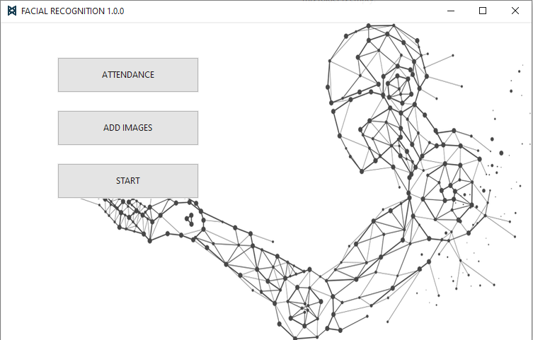
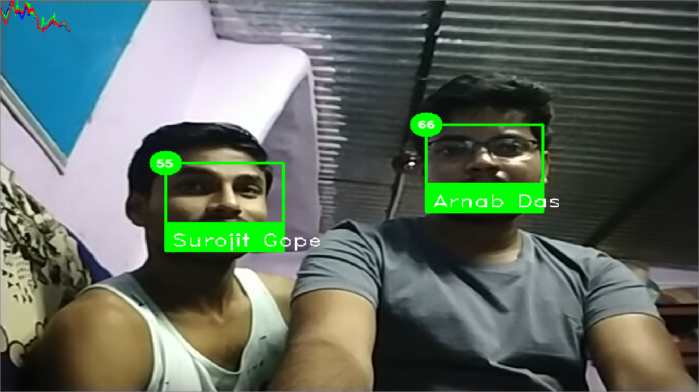

# FACIAL_RECOGNITION
Facial Recognition software to recognise faces and make a Attendence.


<p align="center">
    
    <br>
    <sup>Loading ....</sup>
</p>


<p align="center">
    
    <br>
    <sup>Authors <a href="https://www.linkedin.com/in/arnab-das-732515143" target="_blank">Arnab Das</a></sup>
</p>


<p align="center">
    
    <br>
    <sup>START SCREEN</sup>
</p>


### SAMPLE RESULT IMAGES
<p align="center">
    
    
    
    <br>
    <sup></sup>
</p>


### Getting Started
- Clone the repo and cd into the directory
```sh
$ git clone https://github.com/raj713335/FACIAL_RECOGNITION.git
$ cd FACIAL_RECOGNITION
```


### Install Computer Vision and all the other required libraries 

```sh
$ pip install EasyTkinter
$ pip install opencv-python
$ pip install PyAutoGUI
$ pip install Pillow
$ pip install imutils
$ pip install numpy
$ pip install dlib==19.18
$ pip install cmake
$ pip install psutil
$ pip install tensorflow
```

### List of Python packages that are being used in the Application

```sh
from tkinter import *
import tkinter as tk
from PIL import Image, ImageTk
import tkinter.ttk as ttk
import home
import cv2
from threading import Thread
import pyautogui
import os
from datetime import date
import psutil
```


### To run the Application


```sh
$ cd FACIAL_RECOGNITION
$ python FACIAL_RECOGNITION.py
```


