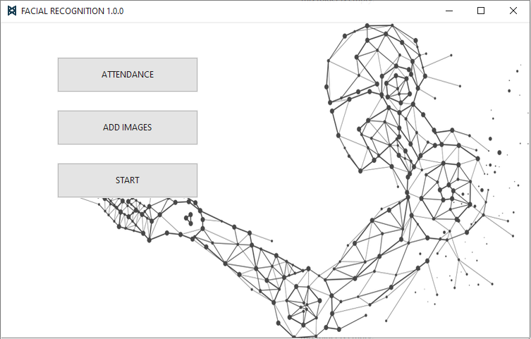
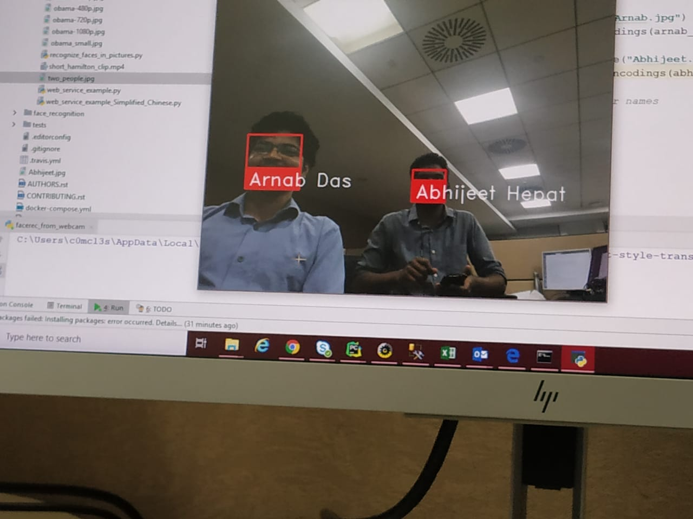

# FACIAL_RECOGNITION
Facial Recognition software to recognise faces and make a Attendence .


<p align="center">
    
    <br>
    <sup>Loading ....</sup>
</p>


<p align="center">
    
    <br>
    <sup>Authors <a href="https://www.linkedin.com/in/arnab-das-732515143" target="_blank">Arnab Das</a></sup>
</p>


<p align="center">
    
    <br>
    <sup>START SCREEN</sup>
</p>


### SAMPLE RESULT

<p align="center">
    
    <br>
    <sup><a href="https://github.com/raj713335/FACIAL_RECOGNITION" target="_blank"><strong>EYEXA</strong></a></sup>
</p>


### SAMPLE IMAGES
<p align="center">
    
    
    
    <br>
    <sup>1.Social Distancing Violation but Mask are on (Left) 2.Social Distancing Violation and Mask are off(Right)3. All Ok (Down)</sup>
</p>


### Getting Started
- Clone the repo and cd into the directory
```sh
$ git clone https://github.com/raj713335/FACIAL_RECOGNITION.git
$ cd EYEXA
```


### Install tensorflow and all the other required libraries 

```sh
$ pip install EasyTkinter
$ pip install opencv-python
$ pip install PyAutoGUI
$ pip install Pillow
$ pip install imutils
$ pip install numpy
```

### List of Python packages taht are being used in the Application

```sh
from tkinter import *
import tkinter as tk
from PIL import Image, ImageTk
import tkinter.ttk as ttk
import home
import cv2
from threading import Thread
import pyautogui
import os
from datetime import date
```


### To run the Application


```sh
$ cd FACIAL_RECOGNITION
$ python FACIAL_RECOGNITION.py
```


